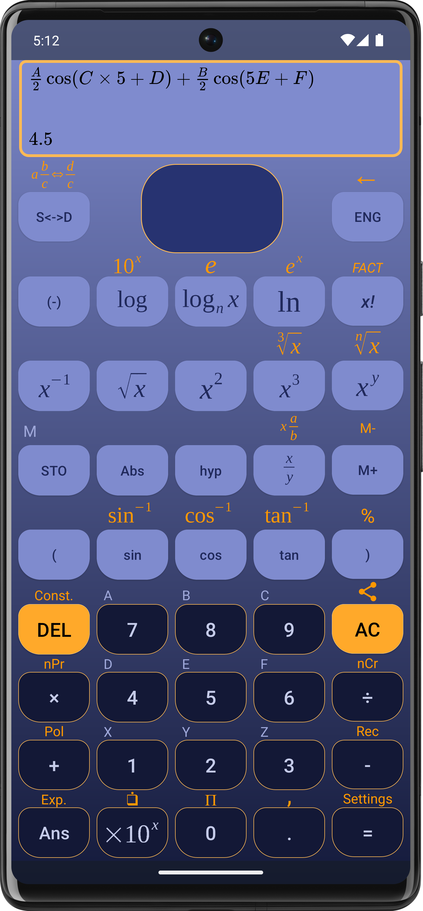

<h1 align="center">
   
  
   
  Calculator
   
</h1>

<h4 align="center">A scientific calculator for Android devices.</h4>

  <a href="#download">Download</a> •
  <a href="#features">Features</a> •
  <a href="#license">License</a> •
  <a href="#acknowledgments">Acknowledgments</a>

  

## Download

You can get the app either from [Google Play](https://play.google.com/store/apps/details?id=com.exponential_groth.calculator) or install the [Android App Bundle](app/release/app-release.aab) manually.

## Features

- basic arithmetic operations
- powers, roots, logarithms, etc.
- prime factorization
- combinations, permutations
- trigonometric and hyperbolic functions
- fractions, mixed numbers
- convertion between polar and rectangular coordinates
- scientific and engineering notation
- result history
- variables
- Solving exponential growth problems
- many settings:
    - customizable colors, button shapes, etc.
    - preferred output ( fraction, decimal, scientific, engineering )

## License

Licensed under the Apache License, Version 2.0 (the "License");
you may not use this file except in compliance with the License.
You may obtain a copy of the License at http://www.apache.org/licenses/LICENSE-2.0

## Acknowledgments

- The [mathview module](mathview) is based on [jianzhongli's Mathview](https://github.com/jianzhongli/MathView)
